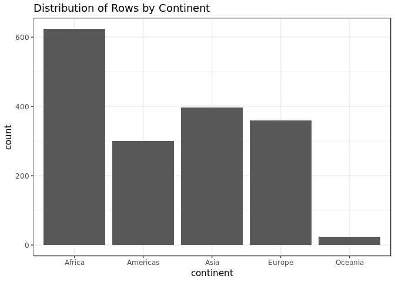
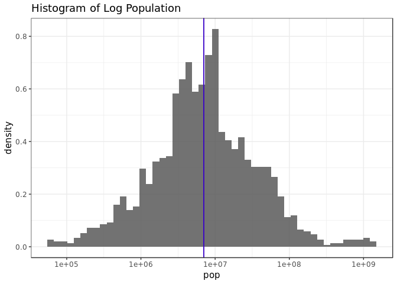
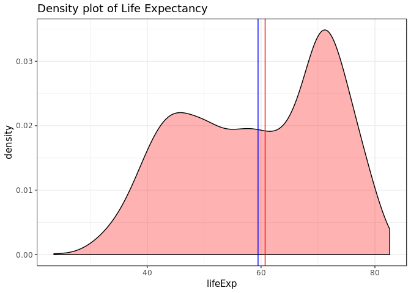
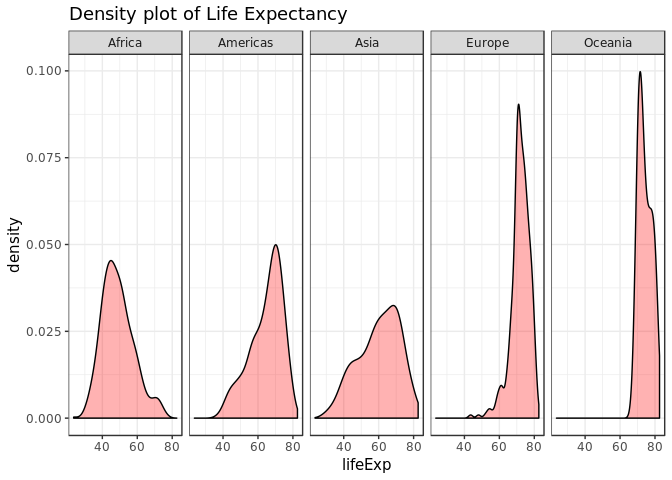
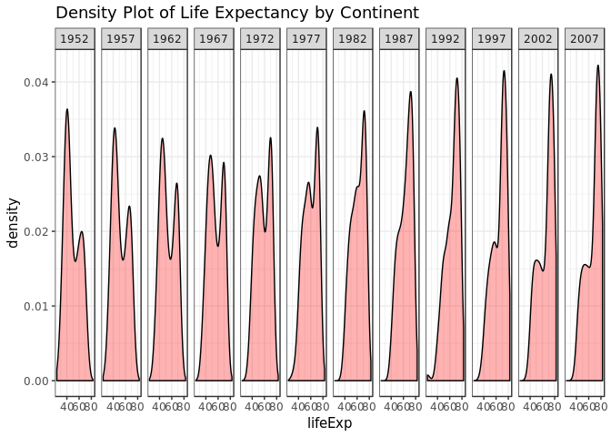
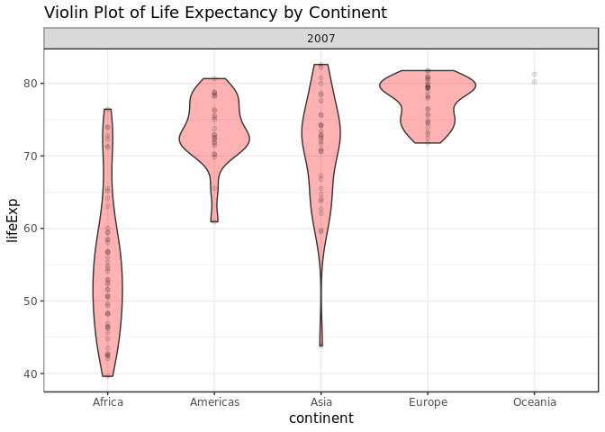
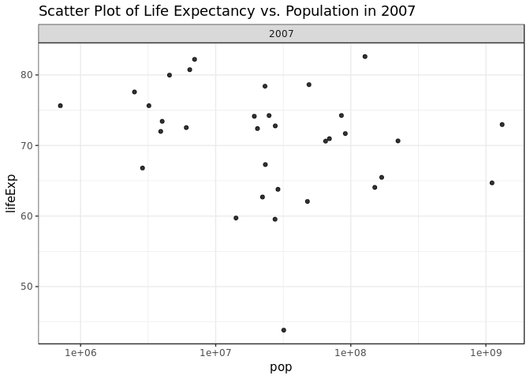
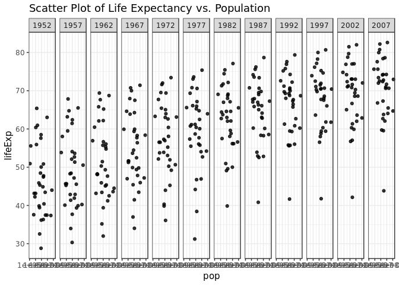
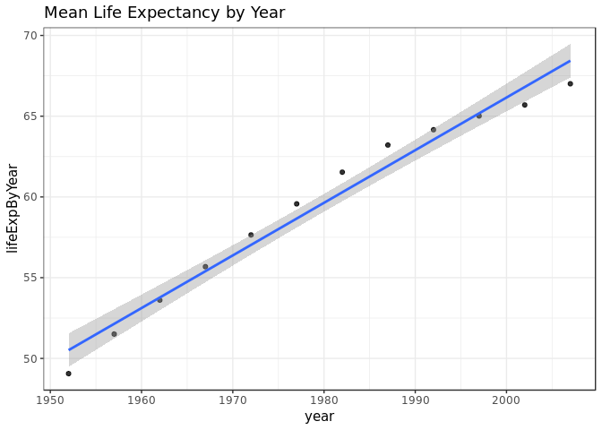
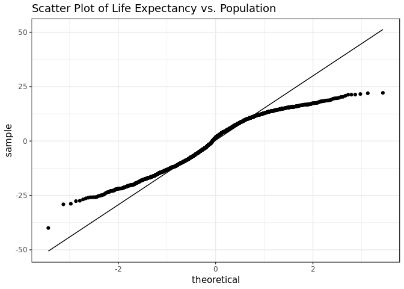

## Introduction

This document will be exploring the "gapminder" dataset as a means of exploring the dplyr and ggplot2 libraries.


```r
# First, I will load the required packages
library(gapminder)
library(tidyverse)
```

```
## -- Attaching packages ---------------------------------- tidyverse 1.2.1 --
```

```
## <U+221A> ggplot2 3.0.0     <U+221A> purrr   0.2.5
## <U+221A> tibble  1.4.2     <U+221A> dplyr   0.7.6
## <U+221A> tidyr   0.8.1     <U+221A> stringr 1.3.1
## <U+221A> readr   1.1.1     <U+221A> forcats 0.3.0
```

```
## -- Conflicts ------------------------------------- tidyverse_conflicts() --
## x dplyr::filter() masks stats::filter()
## x dplyr::lag()    masks stats::lag()
```

## Data Struture:
### Smell Test the Data

In this section I will review the structure, size, and types of data that are present. First, I will look at the type of gapminder. This is important, as it will determine the classes and methods used to access and manipulate the data.


```r
typeof(gapminder)
```

```
## [1] "list"
```

```r
class(gapminder)
```

```
## [1] "tbl_df"     "tbl"        "data.frame"
```

First, notice that the class function lists three classes for the gapminder object, all of which are different than typeof. This is because typeof returns the underlying R type of the object which, in this case, is a list. However, this is not the type that the user will generally interface with; that type is provided by class. 

To answer the first question in the homework, the gapminder object is a _data.frame_, as can be see in the output of class. The class of gapminder is *tbl_df*. Three values are listed by class because table_df inherits from tbl, which inherits from data.frame.

Now, I will examine the size of the data. The gapminder object has ``6`` variables/columns and ``1704`` rows. There are many different ways to get the number of rows and columns. For example:


```r
# The ways used in the inline code above
ncol(gapminder)
```

```
## [1] 6
```

```r
nrow(gapminder)
```

```
## [1] 1704
```

```r
# Here are some different ways to get the number of columns
length(gapminder) # length of the underlying list object
```

```
## [1] 6
```

```r
length(colnames(gapminder)) # length of the column names list
```

```
## [1] 6
```

```r
length(gapminder[1,]) # length of a single row
```

```
## [1] 6
```

```r
# Here are some different ways to get the number of rows
length(gapminder$country)
```

```
## [1] 1704
```

```r
length(gapminder[,1])
```

```
## [1] 1
```

```r
# Here is a way to get a more comprehensive view of the structure
str(gapminder)
```

```
## Classes 'tbl_df', 'tbl' and 'data.frame':	1704 obs. of  6 variables:
##  $ country  : Factor w/ 142 levels "Afghanistan",..: 1 1 1 1 1 1 1 1 1 1 ...
##  $ continent: Factor w/ 5 levels "Africa","Americas",..: 3 3 3 3 3 3 3 3 3 3 ...
##  $ year     : int  1952 1957 1962 1967 1972 1977 1982 1987 1992 1997 ...
##  $ lifeExp  : num  28.8 30.3 32 34 36.1 ...
##  $ pop      : int  8425333 9240934 10267083 11537966 13079460 14880372 12881816 13867957 16317921 22227415 ...
##  $ gdpPercap: num  779 821 853 836 740 ...
```

```r
# We can also use the glimpse function in dplyr to see the structure
glimpse(gapminder)
```

```
## Observations: 1,704
## Variables: 6
## $ country   <fct> Afghanistan, Afghanistan, Afghanistan, Afghanistan, ...
## $ continent <fct> Asia, Asia, Asia, Asia, Asia, Asia, Asia, Asia, Asia...
## $ year      <int> 1952, 1957, 1962, 1967, 1972, 1977, 1982, 1987, 1992...
## $ lifeExp   <dbl> 28.801, 30.332, 31.997, 34.020, 36.088, 38.438, 39.8...
## $ pop       <int> 8425333, 9240934, 10267083, 11537966, 13079460, 1488...
## $ gdpPercap <dbl> 779.4453, 820.8530, 853.1007, 836.1971, 739.9811, 78...
```
The last two functions, str and glimpse, can be very useful. They provides a quick overview of the entire objects size and data types. They are a quick and concise way to get a clear view of the composition of the data.

The variable types of a data fram are the same within each column, but can vary between columns. The types can also be seen with the str function, whose output is shown above. The types are as follows;
- country   : Factor
- continent : Factor
- year      : int
- lifeExp   : num
- pop       : int

We now have a clear idea of the structure, size, and composition of the gapminder dataset. This information will allow us to more easily examine the dataset.

## Explore Individual Variables

In thi section, I will review the variables present in the data table columns. First, I will examine the categorical variables and then I will explor the numeric variables.

The categorical variables are stored in the country and continent columns as factors. Factors are stored as a vector of integers, with an associated label. Each instance of a factor in the column is stored as an integer from this vector, but is shown as the corresponding label.

The tables below show the levels of each categorical variable and the number of rows with each factor.


```r
# Printing a table for each columns shows the the different levels and the
# number of instances at each level
gapminder %>%
  select(continent) %>%
  table()
```

```
## .
##   Africa Americas     Asia   Europe  Oceania 
##      624      300      396      360       24
```

```r
gapminder %>%
  select(country) %>%
  table()
```

```
## .
##              Afghanistan                  Albania                  Algeria 
##                       12                       12                       12 
##                   Angola                Argentina                Australia 
##                       12                       12                       12 
##                  Austria                  Bahrain               Bangladesh 
##                       12                       12                       12 
##                  Belgium                    Benin                  Bolivia 
##                       12                       12                       12 
##   Bosnia and Herzegovina                 Botswana                   Brazil 
##                       12                       12                       12 
##                 Bulgaria             Burkina Faso                  Burundi 
##                       12                       12                       12 
##                 Cambodia                 Cameroon                   Canada 
##                       12                       12                       12 
## Central African Republic                     Chad                    Chile 
##                       12                       12                       12 
##                    China                 Colombia                  Comoros 
##                       12                       12                       12 
##         Congo, Dem. Rep.              Congo, Rep.               Costa Rica 
##                       12                       12                       12 
##            Cote d'Ivoire                  Croatia                     Cuba 
##                       12                       12                       12 
##           Czech Republic                  Denmark                 Djibouti 
##                       12                       12                       12 
##       Dominican Republic                  Ecuador                    Egypt 
##                       12                       12                       12 
##              El Salvador        Equatorial Guinea                  Eritrea 
##                       12                       12                       12 
##                 Ethiopia                  Finland                   France 
##                       12                       12                       12 
##                    Gabon                   Gambia                  Germany 
##                       12                       12                       12 
##                    Ghana                   Greece                Guatemala 
##                       12                       12                       12 
##                   Guinea            Guinea-Bissau                    Haiti 
##                       12                       12                       12 
##                 Honduras         Hong Kong, China                  Hungary 
##                       12                       12                       12 
##                  Iceland                    India                Indonesia 
##                       12                       12                       12 
##                     Iran                     Iraq                  Ireland 
##                       12                       12                       12 
##                   Israel                    Italy                  Jamaica 
##                       12                       12                       12 
##                    Japan                   Jordan                    Kenya 
##                       12                       12                       12 
##         Korea, Dem. Rep.              Korea, Rep.                   Kuwait 
##                       12                       12                       12 
##                  Lebanon                  Lesotho                  Liberia 
##                       12                       12                       12 
##                    Libya               Madagascar                   Malawi 
##                       12                       12                       12 
##                 Malaysia                     Mali               Mauritania 
##                       12                       12                       12 
##                Mauritius                   Mexico                 Mongolia 
##                       12                       12                       12 
##               Montenegro                  Morocco               Mozambique 
##                       12                       12                       12 
##                  Myanmar                  Namibia                    Nepal 
##                       12                       12                       12 
##              Netherlands              New Zealand                Nicaragua 
##                       12                       12                       12 
##                    Niger                  Nigeria                   Norway 
##                       12                       12                       12 
##                     Oman                 Pakistan                   Panama 
##                       12                       12                       12 
##                 Paraguay                     Peru              Philippines 
##                       12                       12                       12 
##                   Poland                 Portugal              Puerto Rico 
##                       12                       12                       12 
##                  Reunion                  Romania                   Rwanda 
##                       12                       12                       12 
##    Sao Tome and Principe             Saudi Arabia                  Senegal 
##                       12                       12                       12 
##                   Serbia             Sierra Leone                Singapore 
##                       12                       12                       12 
##          Slovak Republic                 Slovenia                  Somalia 
##                       12                       12                       12 
##             South Africa                    Spain                Sri Lanka 
##                       12                       12                       12 
##                    Sudan                Swaziland                   Sweden 
##                       12                       12                       12 
##              Switzerland                    Syria                   Taiwan 
##                       12                       12                       12 
##                 Tanzania                 Thailand                     Togo 
##                       12                       12                       12 
##      Trinidad and Tobago                  Tunisia                   Turkey 
##                       12                       12                       12 
##                   Uganda           United Kingdom            United States 
##                       12                       12                       12 
##                  Uruguay                Venezuela                  Vietnam 
##                       12                       12                       12 
##       West Bank and Gaza              Yemen, Rep.                   Zambia 
##                       12                       12                       12 
##                 Zimbabwe 
##                       12
```

```r
# As an aside, if we print the typeof of an instance, we can see the underlying
# integer type
typeof(gapminder$continent[1])
```

```
## [1] "integer"
```

To get a sense of scale, we can look at a simple bar chart. I will not plot the country factor this way, as there are too many levels.


```r
gapminder %>%
  ggplot(aes(x = continent)) + 
  geom_bar() +
  ggtitle("Distribution of Rows by Continent") +
  theme_bw()
```

<!-- -->

Now that we have an idea of the scale, we can begin to get an idea of the districtuion of the factors using summary.


```r
gapminder %>%
  select(country, continent) %>%
  summary()%>%
  knitr::kable()
```

            country        continent 
---  -----------------  -------------
     Afghanistan:  12   Africa  :624 
     Albania    :  12   Americas:300 
     Algeria    :  12   Asia    :396 
     Angola     :  12   Europe  :360 
     Argentina  :  12   Oceania : 24 
     Australia  :  12   NA           
     (Other)    :1632   NA           

From this data, we can see that Asia has the most fields, with ``396`` and Oceania the least, with ``24``. The average number of instances per continent is ``340.8``. The Given how few levels there are, it is very easy to get an idea of the frequency of these factors.

The country factor is even easier, as all countries have exactly 12 instances, as the table holds data for 12 different years.


```r
countryTable = table(gapminder$country)
if(max(countryTable) == min(countryTable))
{
  print("Each level occurs the same number of times.")
}
```

```
## [1] "Each level occurs the same number of times."
```

It will be more interesting now to examine two quantitatve columns, population and lifeExp. I have chosen these columns because population is an integer, and thus discrete, and lifeExp is numeric, and thus continuous. The possible values of an integer are from ``-2147483647`` to ``2147483647``. However, population can only be positive, so the actual minimum of this column will be zero. A double can go between ``2.2250739\times 10^{-308}`` and ``1.7976931\times 10^{308}``. However, similarly, the lifeExp column will not go below 0 or exceed, or closely approach, the maximum recorded human lifespan, around 120.

First, we can look at some summary statistics to see the ranges and the medians, giving us an idea of a typical data point and the distribution.


```r
gapminder %>%
  select(pop, lifeExp) %>%
  summary() %>%
  knitr::kable()
```

          pop               lifeExp    
---  ------------------  --------------
     Min.   :6.001e+04   Min.   :23.60 
     1st Qu.:2.794e+06   1st Qu.:48.20 
     Median :7.024e+06   Median :60.71 
     Mean   :2.960e+07   Mean   :59.47 
     3rd Qu.:1.959e+07   3rd Qu.:70.85 
     Max.   :1.319e+09   Max.   :82.60 

We now have a pretty good idea of the overall distribution of the different values. The median and mean give a sense of "typical" value and the minimum, maximum, and the quartiles give an idea of the distribution.

To get a better idea of the distribution, we can plot a histogram for the discrete variable and a kernel density plot for the continuous variable. I will add the mean and median to the plots as well. The distribution of population is much easier to see with a log scale, so not the histogram, but not the kernel density plot, has a log scaled x-axis. Also note that the mean is calculated for the log scaled population.


```r
# Population Histogram
gapminder %>%
  ggplot(aes(x = pop, y = ..density..)) +
  geom_histogram(bins = 50, alpha = 0.85) +
  geom_vline(xintercept = median(gapminder$pop), colour = 'red') +
  geom_vline(xintercept = exp(mean(log(gapminder$pop))), colour = 'blue') +
  scale_x_log10() +
  theme_bw() +
  ggtitle("Histogram of Log Population")
```

<!-- -->

```r
# Life Expectancy Kernel Density Plot
gapminder %>%
  ggplot(aes(x = lifeExp, y = ..density..)) +
  geom_density(fill = 'red', alpha = 0.3) +
  geom_vline(xintercept = median(gapminder$lifeExp), colour = 'red') +
  geom_vline(xintercept = mean(gapminder$lifeExp), colour = 'blue') +
  theme_bw() +
  ggtitle("Density plot of Life Expectancy")
```

<!-- -->

These plots expose some interesting trends in the data. The population appears to be log normal. This is supported by the fact that the median and the log-scaled mean are very close, as they would be in a log-normal distribution. The life expenctancy appears to be bimodal or even trimodal.

## Explore Various Plot Type:
### Using filter(), select(), and %>%

In this section, I will be using some different plots to get a better understanding of the data. I was interested by the bimodal distribution of life expectancy of the last section, so I will be trying to example what could be causing this.

First, I would like to subset the population by continent and then year, to try to discover if either are a confounding variable.


```r
# Life Expectancy Kernel Density Plot, Faceted by Continent
gapminder %>%
  ggplot(aes(x = lifeExp, y = ..density..)) +
  geom_density(fill = 'red', alpha = 0.3) +
  facet_grid(~continent) +
  theme_bw() +
  ggtitle("Density plot of Life Expectancy")
```

<!-- -->

```r
# Life Expectancy Kernel Density Plot, Faceted by Year
gapminder %>%
  ggplot(aes(x = lifeExp, y = ..density..)) +
  geom_density(fill = 'red', alpha = 0.3) +
  facet_grid(~year) +
  theme_bw() +
  ggtitle("Density Plot of Life Expectancy by Continent")
```

<!-- -->

It appears as though the distribution remains bimodal when sorted by year. However, the relative magnitude of the different peaks varies by year. It also appears as though facetting by continent divides the data so that it looks much more unimodal, though still skewed in every continent.

Lets explore the distribution of life expectancy by continent further. To avoid a confounding effect by year, let's pick the latest year, 2007. A violin plot could clearly show the distribution of life expectancy by continent.


```r
# Life Expectancy Kernel Density Plot, Faceted by Year
gapminder %>%
  filter(year == 2007) %>% # Subsetting by year
  ggplot(aes(x = continent, y = lifeExp)) +
  geom_violin(fill = 'red', alpha = 0.3) +
  geom_point(alpha = 0.1) +
  facet_grid(~year) + # I just kept this to display the year nicely ^_^
  theme_bw() +
  ggtitle("Violin Plot of Life Expectancy by Continent")
```

<!-- -->
Unfortunately, the year alone does not explain the skew in the life expectancy by continent. There are probably other confounding factors.

Next, let's examine if there is a relationship between population and life expectancy. I will limit my observations to Asia.


```r
# Life Expectancy Kernel Density Plot, Faceted by Year
gapminder %>%
  filter(continent == "Asia", year == 2007) %>% # Subsetting by year
  select(lifeExp, pop, year) %>% # Not strictly necessary, but not harmful
  ggplot(aes(x = pop, y = lifeExp)) +
  geom_point(alpha = 0.8) +
  scale_x_log10() +
  facet_grid(~year) + # I just kept this to display the year nicely ^_^
  theme_bw() +
  ggtitle("Scatter Plot of Life Expectancy vs. Population in 2007")
```

<!-- -->

```r
# Life Expectancy Kernel Density Plot, Faceted by Year
gapminder %>%
  filter(continent == "Asia") %>% # Subsetting by year
  select(lifeExp, pop, year) %>% # Not strictly necessary, but not harmful
  ggplot(aes(x = pop, y = lifeExp)) +
  geom_point(alpha = 0.8) +
  scale_x_log10() +
  facet_grid(~year) + # I just kept this to display the year nicely ^_^
  theme_bw() +
  ggtitle("Scatter Plot of Life Expectancy vs. Population")
```

<!-- -->

There is no relationship between population and life expectancy. However, when I faceted by year, I observed that there is a clear trend of increasing life expectancy by year. This is a reasonable trend to expect, given improvements in food security, medicine, and standard of living throughout the world.

I will examine this trend by averaging life expectancy by year and then trying to examine the trend. I will plot a linear regression line that is fitted to all of the points, pre-average.


```r
# Group by year and, each subset, calculate the mean
gapminderYearSummary = gapminder %>%
  group_by(year) %>%
  summarise(lifeExpByYear = mean(lifeExp))

# I won't pipe for this plot, because I am overlaying two data frames
ggplot() +
  geom_point(data = gapminderYearSummary, aes(x = year, y = lifeExpByYear), alpha = 0.8) +
  geom_smooth(data = gapminder, aes(x = year, y = lifeExp), method = 'lm', formula = y~x) + 
  theme_bw() +
  ggtitle("Mean Life Expectancy by Year")
```

<!-- -->

```r
# Get some residuals
lifeExpByYearModel = lm(gapminder$lifeExp~gapminder$year)
gapminder$lifeExpByYearResid = resid(lifeExpByYearModel)
  
# QQ plot to look at the residuals
gapminder %>%
  ggplot(aes(sample = lifeExpByYearResid)) +
  stat_qq() +
  stat_qq_line()+
  theme_bw() +
  ggtitle("Scatter Plot of Life Expectancy vs. Population")
```

<!-- -->

While there is clearly a relationship between life expectancy and year, it is not a simple relationship, as can be seen in the qqplot.

Now we have explored several trends in this dataset and reviewed a few different types of plots.

## But I Want to do More!

In this section, I will look at the additional line:


```r
filter(gapminder, country == c("Rwanda", "Afghanistan"))
```

```
## # A tibble: 12 x 7
##    country    continent  year lifeExp      pop gdpPercap lifeExpByYearRes~
##    <fct>      <fct>     <int>   <dbl>    <int>     <dbl>             <dbl>
##  1 Afghanist~ Asia       1957    30.3  9240934      821.             -21.8
##  2 Afghanist~ Asia       1967    34.0 11537966      836.             -21.4
##  3 Afghanist~ Asia       1977    38.4 14880372      786.             -20.2
##  4 Afghanist~ Asia       1987    40.8 13867957      852.             -21.1
##  5 Afghanist~ Asia       1997    41.8 22227415      635.             -23.4
##  6 Afghanist~ Asia       2007    43.8 31889923      975.             -24.6
##  7 Rwanda     Africa     1952    40    2534927      493.             -10.5
##  8 Rwanda     Africa     1962    43    3051242      597.             -10.8
##  9 Rwanda     Africa     1972    44.6  3992121      591.             -12.4
## 10 Rwanda     Africa     1982    46.2  5507565      882.             -14.1
## 11 Rwanda     Africa     1992    23.6  7290203      737.             -39.9
## 12 Rwanda     Africa     2002    43.4  7852401      786.             -23.4
```

The question is:

> Evaluate this code and describe the result. Presumably the analyst’s intent was to get the data for Rwanda and Afghanistan. Did they succeed? Why or why not? If not, what is the correct way to do this?

This does not get all of the data for Rwanda and Afghanistan. This is because this logical expression does not compare each element in country to Rwanda or Afghanistan and return a logical or. Rather, it compares the odd column indices to Rwanda and the even to Afghanistan. This is equivalent to comparing the country column to a vector created using rep(c("Rwanda","Afghanistan"), nrow(gapminder) / 2). This will miss some rows for each country. One correct way to do this is the following:


```r
gapminder %>%
  filter(country == "Rwanda" | country == "Afghanistan") %>%
  knitr::kable()
```


country       continent    year   lifeExp        pop   gdpPercap   lifeExpByYearResid
------------  ----------  -----  --------  ---------  ----------  -------------------
Afghanistan   Asia         1952    28.801    8425333    779.4453            -21.71108
Afghanistan   Asia         1957    30.332    9240934    820.8530            -21.80960
Afghanistan   Asia         1962    31.997   10267083    853.1007            -21.77412
Afghanistan   Asia         1967    34.020   11537966    836.1971            -21.38064
Afghanistan   Asia         1972    36.088   13079460    739.9811            -20.94216
Afghanistan   Asia         1977    38.438   14880372    786.1134            -20.22168
Afghanistan   Asia         1982    39.854   12881816    978.0114            -20.43520
Afghanistan   Asia         1987    40.822   13867957    852.3959            -21.09672
Afghanistan   Asia         1992    41.674   16317921    649.3414            -21.87424
Afghanistan   Asia         1997    41.763   22227415    635.3414            -23.41476
Afghanistan   Asia         2002    42.129   25268405    726.7341            -24.67828
Afghanistan   Asia         2007    43.828   31889923    974.5803            -24.60879
Rwanda        Africa       1952    40.000    2534927    493.3239            -10.51208
Rwanda        Africa       1957    41.500    2822082    540.2894            -10.64160
Rwanda        Africa       1962    43.000    3051242    597.4731            -10.77112
Rwanda        Africa       1967    44.100    3451079    510.9637            -11.30064
Rwanda        Africa       1972    44.600    3992121    590.5807            -12.43016
Rwanda        Africa       1977    45.000    4657072    670.0806            -13.65968
Rwanda        Africa       1982    46.218    5507565    881.5706            -14.07120
Rwanda        Africa       1987    44.020    6349365    847.9912            -17.89872
Rwanda        Africa       1992    23.599    7290203    737.0686            -39.94924
Rwanda        Africa       1997    36.087    7212583    589.9445            -29.09076
Rwanda        Africa       2002    43.413    7852401    785.6538            -23.39428
Rwanda        Africa       2007    46.242    8860588    863.0885            -22.19479

Some of the other extra work suggested was performed throughout this assignment.

## Conclusion

In this assignement, I explored different variables in the gapminder data frame using ggplot and dplyr. Initially, several columns were explored by type and numerically, and then trends were observed using different plots.
